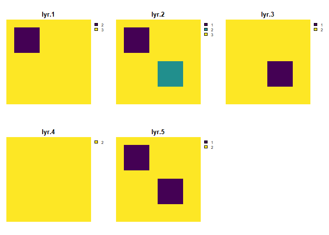

<!-- README.md is generated from README.Rmd. Please edit that file -->

# cdlsim

<!-- badges: start -->

[](https://github.com/burgerhaley97/cdlsim/actions/workflows/R-CMD-check.yaml)
<!-- badges: end -->

The goal of cdlsim is to simulate USDA CDL data to quantify the
sensitivity of metrics calculated on it. The R package landscapemetrics
is used to implement popular FRAGSTATS style metrics in R.

## Installation

You can install the development version of cdlsim from
[GitHub](https://github.com/) with:

``` r
# install.packages("devtools")
devtools::install_github("burgerhaley97/cdlsim")
```

## Example Usage

This is a basic example which shows how a simple landscape would behave
in our simulation:

``` r
library(cdlsim)
 
 # Create a skeleton for the SpatRaster example landscape
 r <- terra::rast(nrows=100, ncols=100, xmin=0, xmax=100, ymin=0, ymax=100)

  # Initialize all cells with class 1
  terra::values(r) <- 1

  # Define coordinates for the two 30x30 squares of class 2
  # First square (top-left corner at (10, 10))
  for (i in 10:39) {  # 10 to 39 makes a 30x30 square
    for (j in 10:39) {
      r[i, j] <- 2
    }
  }

  # Second square (top-left corner at (50, 50))
  for (i in 50:79) {  # 50 to 79 makes a 30x30 square
    for (j in 50:79) {
      r[i, j] <- 2
    }
  }
  
  # Look at the landscape
  terra::plot(r, main = "Simple Landscape", axes = FALSE)
```


``` r
# Make transition matrix with with equal probabilities
  n <- 3
  trans_mat <- matrix(1/3, nrow = n, ncol = n)

  # Assign row and column names
  rownames(trans_mat) <- c("1", "2", "3")
  colnames(trans_mat) <- c("1", "2", "3")
  
  # Look at the transition matrix
  print(trans_mat)
#>           1         2         3
#> 1 0.3333333 0.3333333 0.3333333
#> 2 0.3333333 0.3333333 0.3333333
#> 3 0.3333333 0.3333333 0.3333333

  # Simulate the input SpatRaster 5 times
  patch_sim <- simulate_raster_patch(original_raster = r,
                                       transition_matrix = trans_mat,
                                       iterations = 5)
  
  # Look at the results of 5 simulation 
  terra::plot(patch_sim, axes = FALSE)
```


